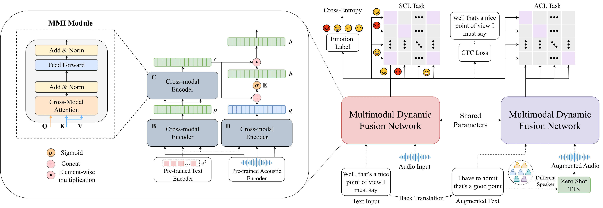

# MMER

This repository contains code for our InterSpeech 2023 paper - [MMER: Multimodal Multi-task Learning for Speech Emotion Recognition](https://arxiv.org/abs/2203.16794)  

### Proposed MMER Architecture:  

  

### Training:  

Tu run our model, please download and prepare data according to instructions below:  
* download the [roberta embeddings](https://drive.google.com/file/d/1xy1Ht2-qb0LwCz50o-y--Nln00d5TOQc/view?usp=sharing) and unzip them in the `data/roberta` folder.  
* download the [roberta embeddings for augmentations](https://drive.google.com/file/d/1KxILCQr7od7pfwdfpJp3VVwZHf0iQczm/view?usp=sharing) and unzip them in the `data/roberta_aug` folder.  
* download the [iemocap dataset](https://sail.usc.edu/iemocap/iemocap_release.htm) and put the tar file in the `data` folder. Then prepare and extract IEMOCAP audio files in `data/iemocap` using instructions in `data_prep` folder.  
* download [iemocap augmented files](https://drive.google.com/file/d/1ldlT8ShpBFmHyYcj5V_ttZ596hF5q_3_/view?usp=sharing) and put them in the `data/iemocap_aug` folder.  

To train MMER, please execute:  
```
sh run.sh
```
You can optionally change the hyper-parameters in `run.sh`. Some useful ones are listed below:    
```
--lambda : weight for auxiliary losses  
--epochs : number of epochs you want your model to train for (defaults to 100)  
--save_path: path to your saved checkpoints and logs (defaults to output/)  
--batch_size: batch size for training (defaults to 2)
--accum_iter: number of gradient accumulation steps (scale accordingly with batch_size)
```

### Inference:  

We provide 2 checkpoints. [Checkpoint 1](https://drive.google.com/file/d/1d_Kd5cn1l9JqZu5vlLme8fe5-zauMMKt/view?usp=sharing) is trained on Sessions 2-5 while [Checkpoint 2](https://drive.google.com/file/d/13on_5CovjqFR_p9eUZBDbLVMt4X5KZL5/view?usp=sharing) is trained on Sessions 1,3,4 and 5. You can download the checkpoints for inference or use checkpoints trained on your own run.

For inference, please execute:  
```
bash infer.sh session_index /path/to/config /path/to/iemocap.csv /path/to/audio /path/to/roberta /path/to/checkpoint

```

If you find this work useful, please cite our paper:  
```
@inproceedings{ghosh23b_interspeech,
  author={Sreyan Ghosh and Utkarsh Tyagi and S Ramaneswaran and Harshvardhan Srivastava and Dinesh Manocha},
  title={{MMER: Multimodal Multi-task Learning for Speech Emotion Recognition}},
  year=2023,
  booktitle={Proc. Interspeech 2023},
}
```
