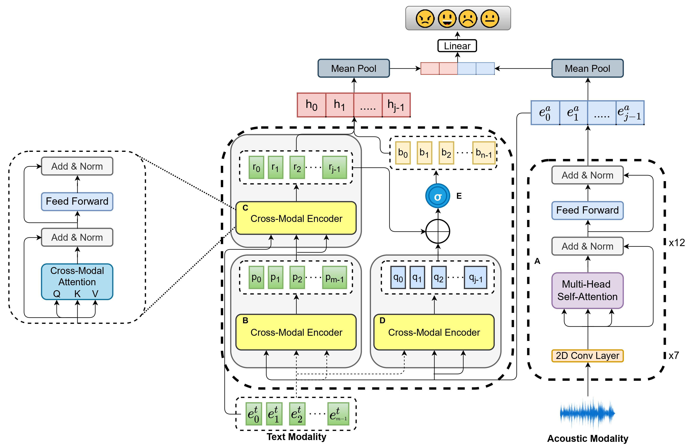

# MMER

This repository contains code for the paper [MMER: Multimodal Multi-task learning for Emotion Recognition in Spoken Utterances](https://arxiv.org/abs/2203.16794)  

### Proposed MMER Architecture:  

  

Tu run our model, first download roberta embeddings using gdown with this [link](https://drive.google.com/file/d/1xCpOWpwuw8eLyjm1fxcyJF8U_qtQDSCc/view?usp=sharing) in the data folder. Then prepare and extract IEMOCAP audio files in data/audio using instructions in data_prep folder.

To run our sota implementation of MMER in the paper, please run:  
```
sh best_run.sh path_to_audio_files \  
path_to_roberta_embeddings \  
path_to_iemocap_csv \  
path_to_save_directory
```
To run other variants, please change the arguments accordingly. Some main arguments are listed below:    
```
--run : you have 3 model variants you can run, cai_sota (implementation of the paper (https://www.isca-speech.org/archive/pdfs/interspeech_2021/cai21b_interspeech.pdf), unimodal_baseline (wav2vec-2.0 baseline) and mmer (our paper). 

--alpha : weight for CTC loss in the final loss  
```

### Checkpoints  
Model | Link   
--- | ---  
cai_sota | [Link](https://drive.google.com/file/d/1E2-hNS3mi6yduUMTScsXUAc8BVp_zqoS/view?usp=sharing)  
unimodal_baseline | [Link]() 
mmer (alpha=0) | [Link](https://drive.google.com/file/d/1xeG-15VzdL3UM2GFMEJLFleEbrqs22cn/view?usp=sharing)    
mmer (alpha=0.1) | [Link](https://drive.google.com/file/d/1Tn14LgHQuK4TUM5iXwwhiC2G_HkJ4Fyr/view?usp=sharing)  
mmer (alpha=0.01) | [Link](https://drive.google.com/file/d/1AycVAC_-gG0u1x7FSwVaEKJtunzk5n91/view?usp=sharing)   
mmer (alpha=0.001) | [Link](https://drive.google.com/file/d/1XGOefZQLGgSJgo4eE0NdTU-tQxmQC0OX/view?usp=sharing)  

Note: The tar.gz files also have logs in them. The models and logs in the folder are in the format{validation_session}_model.pt and {validation_session}_stats.txt.


If you find this work useful, please do cite our paper:  
```
@article{srivastava2022mmer,
  title={MMER: Multimodal Multi-task learning for Emotion Recognition in Spoken Utterances},
  author={Srivastava, Harshvardhan and Ghosh, Sreyan and Umesh, S},
  journal={arXiv preprint arXiv:2203.16794},
  year={2022}
}
```
